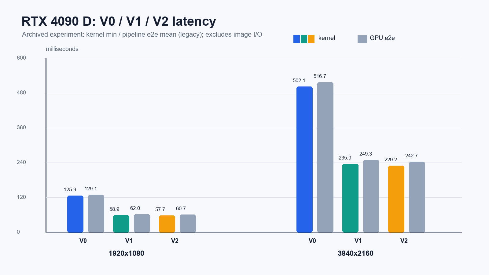
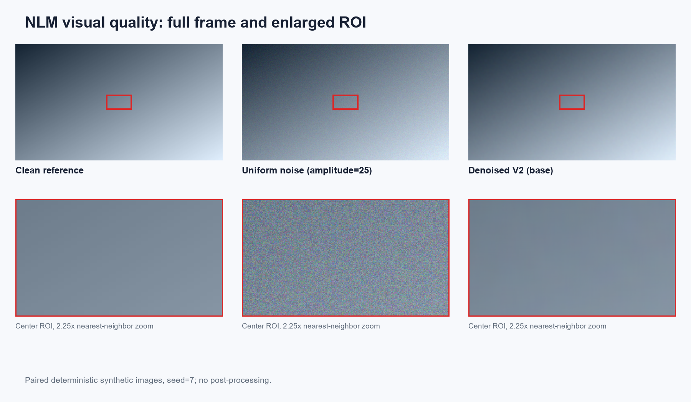

# CUDA 非局部均值图像降噪

2026 夏季训练营 · 选题 07 · blackbook537。支持灰度/RGB PNG、JPG，包含 CPU 参考、三个 GPU 版本、质量验证和性能基准。

目录按参考作业的 `src / include / scripts / assets / test_images` 组织。算法保留本项目实现，NVIDIA 与 Iluvatar 共用 CUDA 源文件，MACA/MUSA 使用各自编译入口。

## 项目结构

```text
blackbook537/
├── src/
│   ├── main.cpp              # 命令行入口
│   ├── kernels.cu           # V0/V1/V2 核心实现，NVIDIA / Iluvatar
│   ├── kernels.maca         # MetaX 编译入口
│   ├── kernels.mu           # Moore Threads 编译入口
│   ├── pipeline.cpp         # 显存、传输、转换与 kernel 调度
│   ├── nlm_cpu_ref.cpp      # 同语义 CPU 参考
│   ├── image_io.cpp         # PNG/JPG 读写
│   ├── params.cpp           # 参数解析
│   ├── benchmark.cpp        # 性能统计
│   ├── metrics.cpp          # MAE / PSNR
│   ├── validate.cpp         # CPU/GPU 对比
│   └── self_check.cpp       # 专项要求保留的功能自检
├── include/                 # 扁平头文件与 stb 依赖
├── scripts/
│   ├── reproduce.sh         # 四平台统一复现入口
│   ├── run_quality_sweep.sh # 配对图像质量扫描
│   ├── collect_environment.sh
│   ├── nsys_profile.sh
│   ├── ncu_profile.sh
│   ├── generate_report_assets.py
│   ├── export_report.py     # 从 Markdown 导出 PDF
│   └── params/              # 非默认参数组
├── assets/                  # 报告图表、results/ 原始证据
├── test_images/             # 示例输入、干净参考和历史降噪示例
├── params.txt               # 默认 pr=3, sr=10, h=10, sigma=25
├── lab_report.md            # 可编辑实验报告
├── lab_report.pdf           # 阅读版实验报告
├── SUBMISSION.md            # 补充文件建议与提交前检查
├── requirements-report.txt # 仅报告工具使用的 Python 依赖
├── Makefile
├── LICENSE
├── .gitattributes
├── .gitignore
└── README.md
```

`build/` 和 `output/` 在运行时生成并被忽略。仓库外层选题目录遵循本季度提交要求。

## 构建与运行

使用 Linux 或 WSL、GNU Make，以及对应平台 SDK。NVIDIA/MetaX/Iluvatar 使用 C++17，Moore 使用 C++11。普通构建不依赖 Python 或 OpenCV。

```bash
cd 07_nlm_denoise/blackbook537
make build PLATFORM=nvidia ARCH=sm_86   # 示例：RTX 3060；4090 D 使用 sm_89
make run PLATFORM=nvidia ARCH=sm_86    # 随附 256×256 RGB 图片，可快速检查

# 1080p 降噪，选择 V2，结果位于 output/images/
make run PLATFORM=nvidia ARCH=sm_86 \
  INPUT=test_images/noisy_1920x1080_3ch_sigma25.png MODE=2

# 自定义输入和参数；JPG 输入请将 OUTPUT 也指定为 JPG
make run INPUT=your_image.jpg OUTPUT=output/images/denoised.jpg PARAMS=params.txt MODE=1
```

各平台构建选项：

| 平台 | 命令 | 主要可覆盖变量 |
|---|---|---|
| NVIDIA | `make build PLATFORM=nvidia ARCH=sm_89` | `NVCC`、`CXX_HOST`、`CUDA_RT`、`ARCH` |
| Iluvatar | `make build PLATFORM=iluvatar` | `COREX_HOME`、`COREX_CXX` |
| MetaX | `make build PLATFORM=metax` | `MACA_HOME`、`MACA_CUDA`、`MXCC` |
| Moore | `make build PLATFORM=moore` | `MUSA_HOME`、`MCC` |

运行时使用相同的 `PLATFORM` 和构建选项。对象及可执行文件按平台隔离；公共入口 `build/nlm_denoise` 指向最后选择的平台副本。脚本使用 `build/<platform>/nlm_denoise`。修改编译器、编译选项或头文件后，Make 会重新编译相应对象。

| 命令 | 行为 |
|---|---|
| `make` / `make build` | 只构建 |
| `make run` | 对图片降噪 |
| `make validate` | 三个 GPU 版本对 CPU 参考计算 MAE/PSNR |
| `make test` | Host 自检和三版本 GPU 验证 |
| `make bench` | 1080p/4K × 灰度/RGB × 四参数组 × 三版本统计 |
| `make clean` | 删除构建产物；保留实验输出 |

## 版本与参数

| GPU 版本 | 实现 | 使用说明 |
|---|---|---|
| V0 (`MODE=0`) | 每线程一像素，全局内存直接访问 | 优化对照 |
| V1 (`MODE=1`) | 带 halo 的 shared memory tile | MetaX 的 Make 默认版本 |
| V2 (`MODE=2`) | V1 + patch 半径模板展开 | 其他平台的 Make 默认版本；pr≥4 回退 V1 |

CPU 参考不占用 GPU 版本编号。直接运行 CLI 时 `--kernel` 默认仍为 2。
`patch_radius` 支持 1–8，`search_radius` 支持 1–32，参数合法范围由解析器检查。默认精确 `expf`；`FAST_EXP=1` 开启近似指数；`WITH_OPENCV=1` 加入可选 OpenCV 对比（需要 `pkg-config opencv4`）。

**算法口径需要关注：** 当前采用 patch 距离求和，噪声减项为 `2*sigma²*N_patch`。题面写作 `2*sigma²`，两者不能直接宣称等价；详见[实验报告](lab_report.md)。生成器的 `--sigma` 表示均匀噪声幅度，不能当作高斯噪声标准差。

## 验证与复现

```bash
make test PLATFORM=nvidia ARCH=sm_86
make validate INPUT=test_images/noisy_1920x1080_3ch_sigma25.png

# 相同输入、相同参数的 GPU 与 CPU 计时
./build/nlm_denoise bench --sizes 1920x1080 --channels 3 --param-sets base \
  --warmup 3 --repeat 10 --with-cpu --cpu-repeat 3 --log output/results/cpu_baseline.csv

# 完整复现；其他平台改 PLATFORM，NVIDIA 指定实际架构
PLATFORM=nvidia ARCH=sm_89 bash scripts/reproduce.sh
PLATFORM=metax bash scripts/reproduce.sh

# 单独复现质量扫描
PLATFORM=nvidia ARCH=sm_86 bash scripts/run_quality_sweep.sh
```

完整矩阵和 CPU 参考耗时较长。快速检查可使用 `SIZES=64x48 VALIDATE_SIZE=64x48 QUALITY_SIZE=64x48 WARMUP=0 REPEAT=1 CPU_REPEAT=1 bash scripts/reproduce.sh`；这种小图检查不替代正式性能验收。

CLI 还提供 `gen`（合成图）、`metrics`（两图指标）和 `units`（Host 自检）。无参数运行可查看帮助。退出码：0 成功、1 验证不通过、2 参数或运行错误。

## 实验报告与证据

[实验报告 PDF](lab_report.pdf) · [Markdown 源稿](lab_report.md) · [原始结果索引](assets/results/README.md) · [补充文件建议](SUBMISSION.md)

历史 1080p RGB/base GPU kernel 数据：4090 D V2 **57.73 ms（最小值）**；S4000 V2 **467.985 ms（均值）**；C500 V1 **418.397 ms（均值）**；MR-V100 V2 **716.595 ms（均值）**。设备与统计口径不同，不能把这些数字直接作为统一排名。





`e2e_ms` 为内存图像处理流程计时，不包含文件解码、编码；`Mpx/s` 当前按 kernel 时间计算。历史材料不能证明本次重构已在所有平台重跑。当前核对记录见 [SUBMISSION.md](SUBMISSION.md)。

## 报告工具与依赖

```bash
python3 -m pip install -r requirements-report.txt
python3 scripts/export_report.py
python3 scripts/generate_report_assets.py --performance-only
```

stb_image v2.30 / stb_image_write v1.16 用于图像编解码；第三方许可证完整保留在对应头文件末尾，项目许可证见 [LICENSE](LICENSE)。所有示例图来源和噪声解释见 [test_images/README.md](test_images/README.md)。
