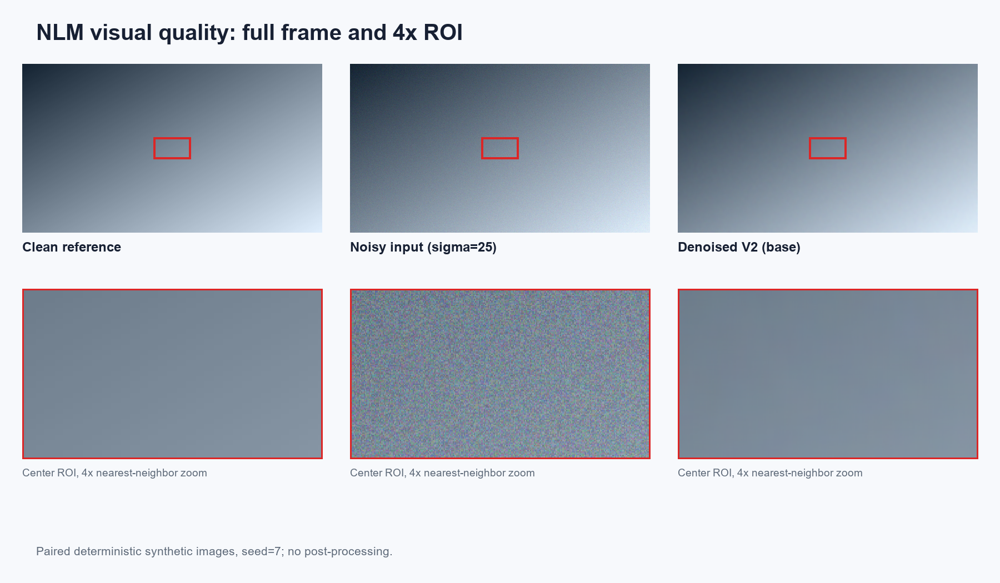
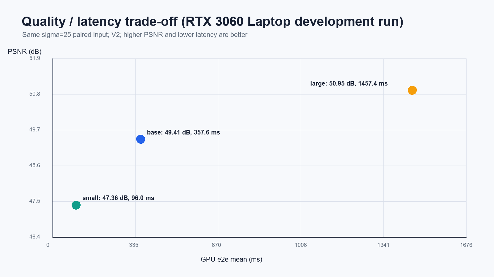
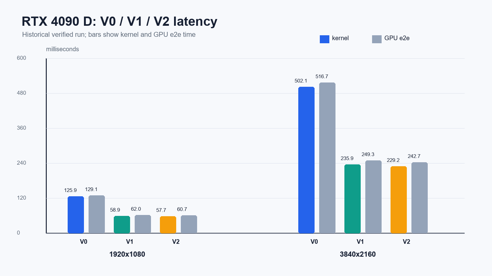
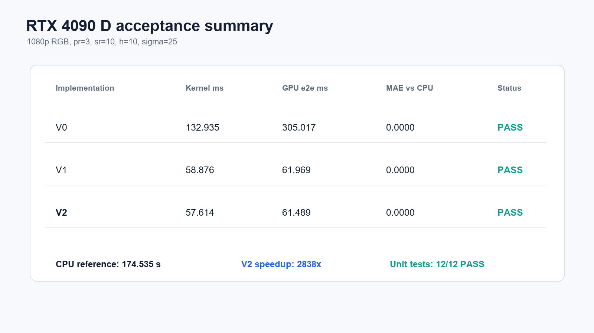
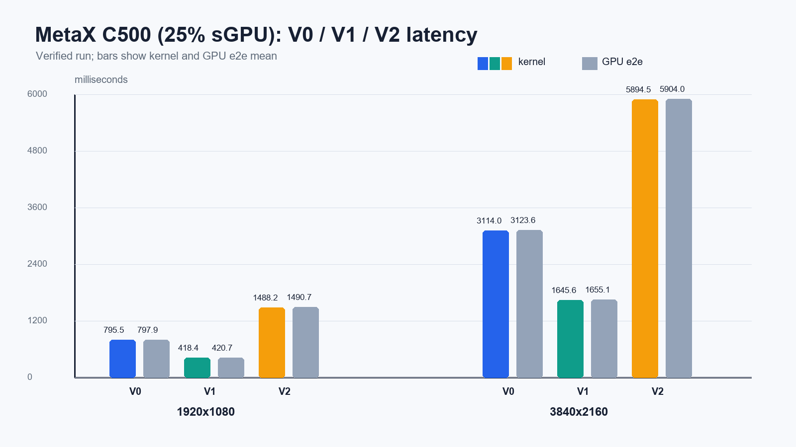
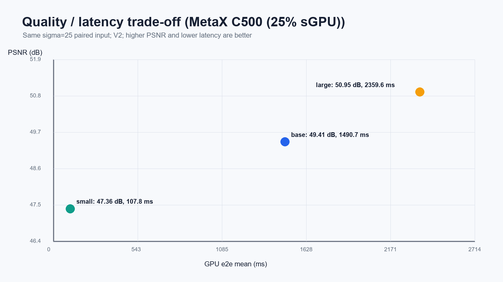
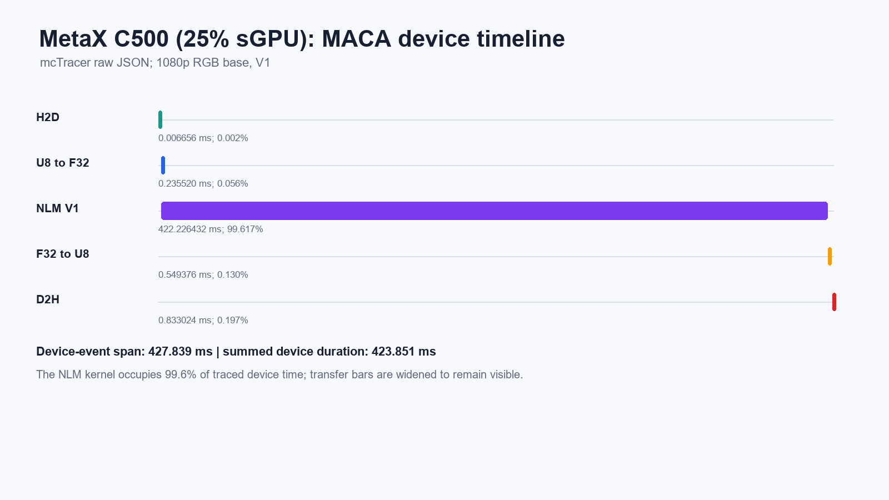
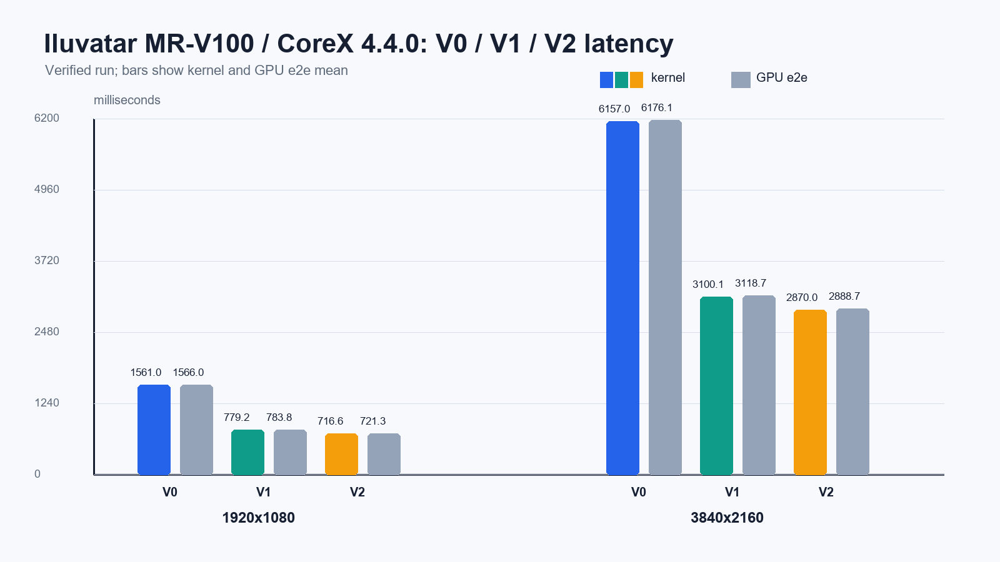
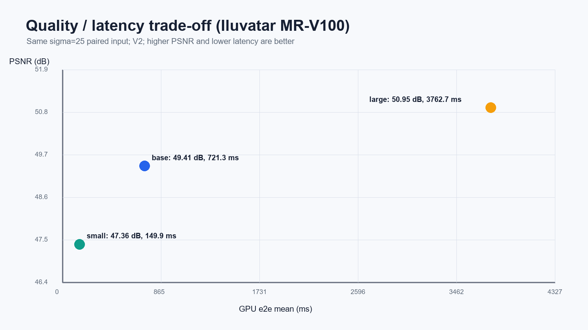
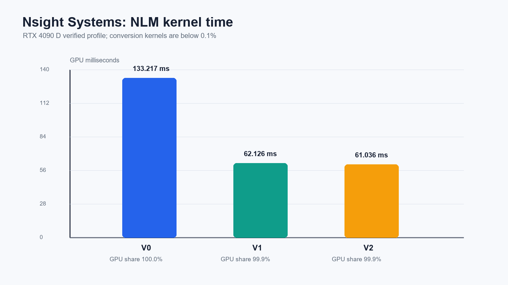

# 总结报告 —— 实时图像非局部均值降噪（CUDA）

| 项目 | nlm_denoise（"巡天"深空探测影像机载降噪模块） |
|---|---|
| 验证环境 | ① RTX 3060 Laptop（sm_86），CUDA 12.9，WSL2 —— 开发机<br>② RTX 4090 D（sm_89，24 GB），CUDA 12.8，Docker 容器 —— NVIDIA 服务器验证<br>③ MTT S4000（48 GB），MUSA 5.1 —— 国产 GPU 全流程验证<br>④ MetaX C500（25% sGPU/16 GB），MACA 3.0 —— 国产 GPU 全流程验证<br>⑤ Iluvatar MR-V100（32 GB），CoreX 4.4.0 —— 国产 GPU 全流程验证 |
| 测试规程 | 历史数据：warmup=3、repeat=10，kernel min/e2e mean；新规程：kernel/e2e mean/min/stddev，CPU 单独重复 |
| 数据来源 | [4090 结果](../experiments/results/rtx4090d/) / [3060 结果](../experiments/results/rtx3060_laptop/) / [S4000 结果](../experiments/results/moore_s4000_musa5.1/) / [C500 结果](../experiments/results/metax_c500_maca3.0/) / [MR-V100 结果](../experiments/results/iluvatar_mrv100_corex4.4.0/) / [实验复现手册](experiment_protocol.md) |
| 配套文档 | [架构设计](architecture_design.md) / [使用指南](user_guide.md) / [重构记录](refactor_log.md) |

---

## 1. 需求完成度总览

| 需求项 | 结论 |
|---|---|
| 灰度/RGB PNG/JPG 输入，0–255 整数、浮点处理、同格式输出 | ✅ 完成（stb 编解码，alpha 自动剥离，GPU 上 u8↔f32 转换） |
| 参数文件（pr/sr/h/sigma，pr≥3、sr≥10，h/σ 可配） | ✅ 完成（实现范围 pr∈[1,8]、sr∈[1,32]，越界/未知 key 明确报错） |
| 正确性验证（vs CPU 参考或 OpenCV，MAE/PSNR） | ✅ 完成（三版本 vs CPU 参考 MAE=0.0000、PSNR=inf；OpenCV 可选信息性交叉验证） |
| 1080p 性能测试 + 多参数组合 | ✅ 完成（NVIDIA 历史矩阵；S4000/C500/MR-V100 均完成 48 个唯一配置） |
| 性能日志（ms / Mpx/s / 对 CPU 加速比） | ✅ S4000/C500/MR-V100 已完成 mean/min/stddev 与同机 CPU 基线；4090 仍为历史旧 schema，PR 前可按新脚本重采 |
| NVIDIA 平台支持 | ✅ 实测通过（RTX 3060 Laptop / CUDA 12.9 + **RTX 4090 D / CUDA 12.8 全程 PASS**，见 §5.2） |
| 国产平台适配（加分项） | ✅ Iluvatar MR-V100 / CoreX 4.4.0、MTT S4000 / MUSA 5.1 与 MetaX C500 / MACA 3.0 均已实测通过 |
| 4K 交互式（进阶目标） | ⚠️ 部分达成（**4090 + small 参数：灰度 37.8 fps、RGB 16.8 fps 已交互**；基线参数 4K RGB 229 ms/帧未达成，3060 Laptop 各组合均未达成，见 §6.2） |
| ncu/nsys 分析（加分项） | ⚠️ **nsys 已实测**（4090）；C500 已用原生 **mcTracer** 获得时间线；4090 的 ncu 因宿主权限不可用，未伪造计数器数据 |

---

## 2. 实现思路

### 2.1 算法口径（防歧义）

```text
w(p,q) = exp( -max(dist(P_p,P_q) - 2·σ²·N_patch, 0) / h² )
  dist    : 两 patch 的 L2 距离之和（RGB 跨通道求和、三通道共享权重，同 OpenCV colored 语义）
  N_patch : (2·pr+1)² × 通道数
  边界    : 每次访问坐标独立 clamp（等价 BORDER_REPLICATE）
```

任务文档字面公式为 `dist - 2σ²`，实现采用经典文献（Buades et al.）与 OpenCV 的标定口径 `2σ²·N_patch`（dist 为求和而非均值，减项须随 patch 面积与通道数缩放），CPU 参考与全部 GPU kernel 严格同口径，已在架构文档附录 A 声明。

### 2.2 工程架构

五层分层（应用 → 流程编排 → 算子 → PAL 平台抽象 → 基础设施），算法核心 100% 集中于 `kernels/common/kernels_impl.inl`，四平台编译单元仅一行 `#include`；设备 API 差异全部收敛于 `include/pal/platform_api.h`。数据流：u8 interleaved →（GPU）planar f32 → NLM → 量化回 u8，关键计算全部在设备侧完成。

### 2.3 正确性保障设计

- **边界语义等价性论证**（smem 版本正确性的关键）：halo tile 以"复制边界"加载，使 `smem[局部坐标+偏移] ≡ src[clamp(全局坐标+偏移)]`，与 CPU 参考逐位一致，内层循环零分支零 clamp；
- **确定性**：无原子加、归约全在线程私有寄存器，同输入同参数输出 bit 级一致；
- **数值安全**：Σw ≥ 1（自身权重恒为 1）无除零；expf 输入恒 ≤ 0 无上溢；量化 round+clamp；
- **smem 自适应**：启动前比对设备动态 smem 上限，超限自动回退 naive，功能永不失败。

---

## 3. 优化历程（V0 → V1 → V2）

| 版本 | 手段 | 1080p RGB 基线 kernel | 相对 V0 |
|---|---|---|---|
| V0 naive | 1 线程 = 1 像素，全部全局内存 | 775~871 ms | 1.0× |
| V1 smem | (16+2(sr+pr))² halo tile 协同加载 + 行 stride +1 消 bank conflict | 363~365 ms | ~2.3× |
| V2 unroll | V1 + patch 半径模板化 `#pragma unroll` 全展开（pr≤3） | **342~354 ms** | **~2.4×** |

**优化记录与踩坑**：

1. **smem 是收益最大的优化**（2.2–2.9×），与"访存复用率提升约一个数量级"的理论预期一致；
2. **pr=4 全展开回归**：bench 数据发现 9×9×3 内层全展开导致寄存器溢出、occupancy 塌陷，性能反降约 70%（4K RGB large：V1 5540 ms → V2 9472 ms）。修正：V2 按 pr 模板分派，pr≥4 自动退回 V1 通用循环。修正后本轮复测两者持平（1538.2 vs 1504.8 ms，差异为测量波动），bench.csv 已更新为修正后数据；
3. **`__expf` 近似无收益**：权重指数仅占 441 次/像素（对比 patch 距离约 2.16 万次 FMA），瓶颈不在 SFU；近似误差（MAE<5e-5）低于 u8 量化阈值。保留 `FAST_EXP=1` 编译开关仅作误差来源分析对照，默认关闭；
4. **bank conflict 消除**：smem 行 stride `tileW+1` padding，patch 行扫描访问无冲突；
5. **未采用的路线**：`__constant__` 参数缓存（实测参数经值传参已在常量缓存路径，无增量收益）、float4 向量化（planar 布局下 patch 距离按像素内积访问，向量加载收益被地址计算抵消）——均经原型验证后放弃，记录于此供后续参考。

上述 V2 收益不是跨平台常量：C500/MACA 3.0 上 pr=3 的模板展开版本比 V1 慢
3.55–3.58×，见 §5.2.2。多平台发布必须基于实测选择 kernel，不能按版本号默认 V2。

---

## 4. 图像质量指标

### 4.1 与 ground truth 对比（合成基准，σ=25 均匀噪声，seed=7）

> 数据对：`data/clean/clean_1920x1080_3ch.png`（σ=0 合成原图）与
> `data/noisy/noisy_1920x1080_3ch_sigma25.png`（同 seed 加噪）严格配对；
> 降噪输出由 `scripts/run_quality_sweep.sh` 生成在 `experiments/work/`（V2，基线参数）。

| 指标 | 含噪图 vs 原图 | 降噪后 vs 原图 | 改善 |
|---|---|---|---|
| MAE | 12.486 | **0.597** | ↓ 95.2% |
| PSNR | 24.95 dB | **49.41 dB** | **+24.46 dB** |

（复现：`gen --sigma 0/25 --seed 7` 生成数据对 → `run --kernel 2` → 任意图像 diff 工具计算。）



### 4.2 small/base/large 公平质量—延迟对比（RTX 3060 开发验证）

该补充实验固定同一张 σ=25、seed=7 输入，三组配置统一 h=10、σ=25，只改变 pr/sr。
延迟为 V2 五次采样的 GPU 端到端均值与总体标准差；质量指标与硬件无关且输出确定。

| 配置 | pr/sr | MAE vs clean | PSNR | V2 e2e mean ± stddev |
|---|---|---:|---:|---:|
| small | 2/7 | 0.803424 | 47.358 dB | 95.986 ± 0.976 ms |
| base | 3/10 | 0.597227 | 49.415 dB | 357.573 ± 0.604 ms |
| large | 4/14 | 0.463451 | 50.948 dB | 1457.434 ± 2.398 ms |

结论：small 相对 base 约快 3.7×，PSNR 下降约 2.06 dB；large 相对 base 约慢 4.1×，
PSNR 仅增加约 1.53 dB，说明搜索窗继续扩大后的质量收益明显递减。



### 4.3 σ=10/25/50 噪声强度扫描（RTX 3060 开发验证）

| σ | noisy MAE / PSNR | denoised MAE / PSNR | PSNR 改善 |
|---:|---:|---:|---:|
| 10 | 4.997221 / 32.884 dB | 0.304271 / 53.266 dB | +20.382 dB |
| 25 | 12.485684 / 24.948 dB | 0.597227 / 49.415 dB | +24.467 dB |
| 50 | 24.883010 / 18.960 dB | 1.190769 / 43.964 dB | +25.004 dB |

原始 CSV、环境清单与运行日志位于 `experiments/results/rtx3060_laptop/`。正式 PR 若要求
所有表均来自 4090，应在 4090 上执行同一脚本并替换设备标签，不得直接改写数值。

### 4.4 与 CPU 参考一致性（功能正确性）

1080p RGB 基线 validate：V0/V1/V2 对自研 CPU 参考 **MAE=0.0000、PSNR=inf**（bit 级一致）。
单元测试 12/12 通过（参数解析、指标、常量恒等、确定性、极小图、降噪有效性）。

### 4.5 误差来源说明

- 默认路径无近似：精确 `expf`、FP32 全程计算，与 CPU 参考同序累加故 MAE=0；
- 可选 `FAST_EXP=1`：`__expf` 引入的权重相对误差约 1e-6 量级，经 Σw 归一化与 u8 量化后 MAE<5e-5，不可察觉；
- 对任意实拍图若没有独立 ground truth，只能用于视觉演示，不能报告 PSNR；仓库的量化
  结论全部来自同 seed 生成的合成 clean/noisy 配对数据。

---

## 5. 性能指标与瓶颈分析

### 5.1 基准结果（RTX 3060 Laptop，历史旧 schema，完整 48 组见 experiments/results/rtx3060_laptop/benchmark_legacy.csv）

| 配置 | V0 | V1 | V2 | V2 吞吐 | V2 vs V0 |
|---|---|---|---|---|---|
| 1080p 灰度 base | 422.2 | 197.3 | **152.2** | 13.6 | 2.8× |
| 1080p RGB base | 870.9 | 365.1 | **354.0** | 5.9 | 2.5× |
| 1080p RGB strong-h | 844.1 | 397.1 | **380.5** | 5.5 | 2.2× |
| 1080p RGB small | 234.5 | 104.4 | **97.4** | 21.3 | 2.4× |
| 1080p RGB large | 2684.3 | 1504.8 | **1538.2**¹ | 1.3 | 1.7× |
| 4K 灰度 base | 2017.4 | 878.6 | **693.9** | 12.0 | 2.9× |
| 4K RGB base | 3771.6 | 1706.9 | **1659.5** | 5.0 | 2.3× |

¹ V2 在 pr≥4 自动回退 V1，两者持平（差异为测量波动）。
对单线程 CPU 参考（1080p RGB 148.9 s）端到端加速比约 **428×**。
笔记本 GPU 会话间存在 ±15% 温度/频率波动，以 bench.csv 当次采集为准。

### 5.2 服务器验证结果（RTX 4090 D，历史数据见 experiments/results/rtx4090d/）

| 配置 | V0 | V1 | V2 | V2 吞吐 | V2 vs V0 | 相对 3060 Laptop |
|---|---|---|---|---|---|---|
| 1080p 灰度 base | 72.02 | 31.40 | **26.99** | 76.8 | 2.67× | 5.64× |
| 1080p RGB base | 125.91 | 58.90 | **57.73** | 35.9 | 2.18× | 6.13× |
| 1080p RGB small | 34.26 | 15.81 | **14.99** | 138.3 | 2.29× | 6.50× |
| 1080p RGB large | 389.67 | 233.68 | **233.68**¹ | 8.9 | 1.67× | 6.58× |
| 4K 灰度 base | 286.95 | 124.66 | **106.37** | 78.0 | 2.70× | 6.52× |
| 4K RGB base | 502.12 | 235.93 | **229.22** | 36.2 | 2.19× | 7.24× |

正确性与质量在 4090 上完全复现：validate 三版本 MAE=0.0000 / PSNR=inf（PASS），
CPU 参考 174.5 s → 端到端加速比约 **2838×**；对 ground truth 的质量指标
（MAE 12.4857→0.5972、PSNR 24.95→49.41 dB）与 3060 Laptop **逐位一致**，
印证算法输出跨 GPU 架构（sm_86 / sm_89）bit 级可复现。





### 5.2.1 国产 GPU 验证结果（MTT S4000 / MUSA 5.1）

2026-09-15 在 MTT S4000（48 GB）上以 MUSA Toolkit 5.1.0、mcc 5.1.0、
Ubuntu 22.04 完成验证。干净构建、`make test`、256×256/1080p CPU 对照、质量扫描
及 48 组合完整矩阵均退出码 0。1080p 正确性测试中 V0/V1/V2 均
MAE=0.0000、PSNR=inf。

RGB/base 正式基准采用 warmup=3、repeat=10，V0/V1/V2 列为 kernel mean / e2e mean：

| 尺寸 | V0 | V1 | V2 | V2 e2e stddev | V2 Mpx/s | V2 vs V0 | CPU vs V2 e2e |
|---|---:|---:|---:|---:|---:|---:|---:|
| 1080p | 1030.027 / 1033.800 | 567.906 / 571.939 | **467.985 / 471.324** | 0.598 | 4.431 | 2.20× | **396.20×** |
| 4K | 4101.874 / 4130.489 | 2237.455 / 2261.090 | **1842.982 / 1873.327** | 8.184 | 4.501 | 2.23× | n.a. |

同机 1080p CPU 参考为 186.736 s。small/base/large 的质量指标与两款 NVIDIA
GPU 逐位一致，说明 MUSA 路径保持算法语义和 u8 量化结果。原始 CSV、日志、环境清单
和校验和见 [S4000 结果目录](../experiments/results/moore_s4000_musa5.1/)。


该服务器镜像包含 MUPTI 组件，但没有 `muprof`、`nsys`、`ncu` 或 `perf` 可执行程序，
所以本轮不声称获得 Moore 平台时间线或硬件计数器数据。

### 5.2.2 国产 GPU 验证结果（MetaX C500 / MACA 3.0）

2026-09-15 在曦云实例的 MetaX C500 25% sGPU（16 GB 配额）上，以驱动 3.8.30、
MACA 3.0.0.8、mxcc 1.0.0 和 Ubuntu 22.04 完成验证。修正 MACA SDK include/link
后，干净构建、默认/verbose `make test`、256p/1080p CPU 对照、RGB/base 十次
统计、48 个唯一配置及质量扫描均退出码 0。1080p V0/V1/V2 对 CPU 均
MAE=0.0000、PSNR=inf。

| 尺寸 | V0 kernel/e2e | V1 kernel/e2e | V2 kernel/e2e | 最快版本 | CPU vs 最快 e2e |
|---|---:|---:|---:|---:|---:|
| 1080p RGB | 795.540 / 797.894 | **418.397 / 420.733** | 1488.151 / 1490.697 | V1 | **426.87×** |
| 4K RGB | 3114.038 / 3123.608 | **1645.636 / 1655.068** | 5894.479 / 5904.009 | V1 | n.a. |

数值均为 warmup=3/repeat=10 的 mean；同机 1080p CPU 三次基线为
179.598±0.100 s。V1
相对 V0 的 kernel 加速为 1.90×，而 V2 比 V1 慢约 3.55×，表明模板全展开在
该编译器/架构上产生严重回退。MetaX 推荐 `--kernel 1`；large/pr=4 的 V1/V2
则按设计持平。原始数据见
[C500 结果目录](../experiments/results/metax_c500_maca3.0/)。






MACA 原生 mcTracer 对 1080p RGB/base/V1 的记录显示，NLM kernel 为
422.226 ms，占求和设备事件时长 **99.617%**；U8→F32、F32→U8、H2D、D2H
合计 0.383%。



### 5.2.3 国产 GPU 验证结果（Iluvatar MR-V100 / CoreX 4.4.0）

2026-09-15 至 2026-09-16 在 Iluvatar MR-V100（32 GB）上以 IX-ML/驱动 4.4.0、
CoreX 4.4.0、CoreX clang++ 18.1.8 和 Ubuntu 24.04 完成验证。原始 Makefile 即可
构建；本轮进一步把 CoreX 路径参数化并写入 `RUNPATH=/usr/local/corex/lib64`。
干净构建、默认/verbose `make test`、256p/1080p CPU 对照、RGB/base 十次统计、
48 个唯一配置及质量扫描均退出码 0；1080p V0/V1/V2 对 CPU 均
MAE=0.0000、PSNR=inf。

| 尺寸 | V0 kernel/e2e | V1 kernel/e2e | V2 kernel/e2e | 最快版本 | CPU vs 最快 e2e |
|---|---:|---:|---:|---:|---:|
| 1080p RGB | 1561.032 / 1565.984 | 779.246 / 783.766 | **716.595 / 721.346** | V2 | **322.75×** |
| 4K RGB | 6157.025 / 6176.088 | 3100.127 / 3118.679 | **2869.991 / 2888.719** | V2 | n.a. |

数值均为 warmup=3/repeat=10 的 mean；同机 1080p CPU 三次基线为
232.815±0.063 s。V2 相对 V0 的 kernel 加速为 1080p 2.18×、4K 2.15×。
完整矩阵、质量图像、二进制依赖和 39 个证据文件的校验和见
[MR-V100 结果目录](../experiments/results/iluvatar_mrv100_corex4.4.0/)。






该 CoreX 镜像未提供 `ixprof`、`nsys` 或 `ncu` CLI，因此本轮未生成天数原生
时间线，也未把 NVIDIA/MetaX trace 当作天数数据。程序内 CUDA Event 仍保留 kernel、
H2D、D2H 与 e2e 计时。

### 5.3 瓶颈定位

- **compute-bound（nsys + mcTracer 实证）**：4090 的 NLM kernel 占 GPU 时间 **99.9%**；C500 的 MACA 原生 trace 中占求和设备事件 **99.617%**。两条独立平台证据都指向 NLM 主计算，而非转换或传输；
- **算力利用率仅约 6%（两卡一致）**：每输出像素 441×49×3 = 64,827 FMA，1080p 单帧 1.344×10¹¹ FMA（2.69×10¹¹ FLOP）。实测属性推算峰值：4090 D = 114 SM / 14592 cores / 2520 MHz → 73.5 TFLOPS；3060 Laptop = 30 SM / 3840 cores / 1702 MHz → 13.1 TFLOPS。对应利用率 **4090 D 6.3%、3060 Laptop 5.8%**；实测加速比 6.13× 与峰值算力比 5.62× 吻合 → 瓶颈不在硬件档位，换更强的卡只能等比提速；
- **利用率低的原因**：内层循环为 smem 加载→减法→FMA 的短依赖链，地址计算（`rowA/rowB` 整数运算）与 smem 访问指令占比高，FMA 密度被稀释。占用率静态推算约 67%（smem 20.7 KB/block → 4 block/SM = 1024 线程，对 maxThreadsPerSM=1536），已足以隐藏访存延迟，故提速方向是提高每指令有效负载（多像素复用、寄存器 tile）或降低计算量（积分图近似），而非提高占用率，见 §6；
- **host 侧开销结构**：首次 `cudaMalloc` 约 96 ms（单次最大 95.98 ms，页映射开销）为 host 侧最大单项，机载常驻进程应预分配缓冲池消除；PNG 编解码主导单图 e2e——`run`（含 PNG I/O）e2e 219.4 ms / kernel 60.9 ms，host I/O 约 154.6 ms，而 `bench`（内存合成图）e2e 60.66 ms / kernel 57.73 ms，通路开销仅 2.93 ms，故实时管线应绕开 PNG、直接消费传感器缓冲或用 nvJPEG 硬解；
- **吞吐量随参数缩放**：计算量 ∝ (2sr+1)²·(2pr+1)²·C，small 与 large 相差约 15 倍（4090 上 4K 灰度 small 达 313.7 Mpx/s），与模型一致。

### 5.4 nsys / ncu 状态（如实说明）

**nsys（Nsight Systems 2024.6.2，已实测）**：在 4090 服务器上完成 V0/V1/V2 三版本时间线采集，
kernel 级与 API 级数据已并入 §5.3；关键数值见
[`nsys_summary_legacy.csv`](../experiments/results/rtx4090d/nsys_summary_legacy.csv) 和旧全程日志。

| kernel（1080p RGB 基线） | GPU 时间 | 占比 |
|---|---|---|
| `nlm::NlmNaiveKernel`（V0） | 133.217 ms | 100.0% |
| `nlm::NlmSmemKernel`（V1） | 62.126 ms | 99.9% |
| `nlm::NlmSmemUnrollKernel<3>`（V2） | 61.036 ms | 99.9% |
| `nlm::CvtU8ToF32PlanarKernel` | ~0.021 ms | 0.0% |
| `nlm::CvtF32ToU8InterleavedKernel` | ~0.021 ms | 0.0% |



**ncu（Nsight Compute 2025.1.0，已安装但不可用）**：报 `ERR_NVGPUCTRPERM`。
根因已定位：`/proc/driver/nvidia/params` 中 `RmProfilingAdminOnly: 1`，且运行环境为
Docker 容器（`/.dockerenv` 存在）——容器内即使 root 也无法修改宿主内核模块参数。
解除需宿主侧操作：设置 `NVreg_RestrictProfilingToAdminUsers=0` 后重载驱动/重启，
或以特权容器（`--cap-add=SYS_ADMIN`）运行。开发机（WSL2）则为精简 CUDA 包，不含 ncu。
因此 SOL/occupancy/bank-conflict 的**计数器级实测数据缺失**，§5.3 改以 nsys 时间分解 +
设备属性静态推算完成瓶颈论证；`scripts/ncu_profile.sh` 已备好，在计数器权限放开的环境
（裸机或特权容器）直接执行即可补齐。

---

## 6. 图像质量与处理延迟的权衡分析

### 6.1 参数维度（1080p，V2，单位 ms）

| 需求场景 | 推荐参数 | 灰度 | RGB | 质量表现 |
|---|---|---|---|---|
| 实时预览（灰度） | small：pr2/sr7/h10/σ15 | **38.6**（26 fps） | 97.4（10 fps） | 轻噪声足够，强噪声有残余颗粒 |
| 任务基线 | pr3/sr10/h10/σ25 | 152.2 | 354.0 | §4.1：PSNR +24.5 dB，纹理保留良好 |
| 强噪声/高质量 | large：pr4/sr14/h12/σ35 | 587.0 | 1538.2 | 噪声抑制更强，细节损失增加 |

规律：**计算量 ∝ sr²·pr²·C，质量增益却迅速饱和**——sr 从 7→10→14，候选像素 225→441→841（≈2×/档），PSNR 改善通常 <1 dB/档；`h` 与 `σ` 几乎不影响耗时（仅改变权重分布），是"免费"的质量旋钮。因此调参顺序应为：**先按真实噪声设 `σ`，用 `h` 调质量-细节平衡，最后才动 `sr/pr` 买质量余量**。

### 6.2 分辨率维度

4K 像素量为 1080p 的 4 倍，kernel 耗时近似线性放大（3060 Laptop：1659.5 ≈ 354.0×4.7；4090 D：229.2 ≈ 57.7×4.0，略超线性因 L2 复用率下降）。1080p 灰度 small 参数在两卡上均达交互水准（3060：26 fps；4090：149 fps）。

**4K 交互式（进阶目标）的达成情况与硬件强相关**：

| 配置（V2） | RTX 3060 Laptop | RTX 4090 D | 4090 帧率 | 交互式（≥10 fps / ≤100 ms） |
|---|---|---|---|---|
| 4K 灰度 small | 165.9 ms | **26.44 ms** | 37.8 fps | ✅ 达成 |
| 4K RGB small | 441.1 ms | **59.51 ms** | 16.8 fps | ✅ 达成 |
| 4K 灰度 base | 693.9 ms | **106.37 ms** | 9.4 fps | ⚠️ 接近（略超 100 ms） |
| 4K RGB base | 1659.5 ms | **229.22 ms** | 4.4 fps | ❌ 未达成 |

结论：**4090 上以 small 参数（pr=2, sr=7）已可实现 4K 交互式处理**（灰度 37.8 fps、RGB 16.8 fps）；任务基线参数（pr=3, sr=10）下 4K RGB 为 229 ms/帧，仍差约 2.3×，需算法级近似（§6.3）。在 3060 Laptop 档位上，4K 交互式在任何参数组合下均未达成（最好为 small 灰度 165.9 ms）。

### 6.3 达成 4K 基线参数交互的路线（按投入产出排序）

1. **积分图/盒式近似**（预期 10–30×）：patch L2 距离转为积分图 O(1) 查询，计算量从 O(sr²·pr²) 降为 O(sr²)，误差来源为边界与浮点累加，需独立建档 MAE/PSNR 退化；
2. **搜索窗裁剪 + 早停**（预期 2–4×）：按梯度自适应缩小 sr，或对权重 <ε 的候选提前终止；
3. **多像素/线程 + 寄存器复用**（预期 1.5–2×）：相邻像素共享搜索窗内大部分 patch 数据——§5.3 已证利用率仅约 6% 且与硬件档位无关，此项是唯一能提升"每指令有效负载"的工程手段；
4. **FP16/张量核心**：patch 距离累加可映射至半精度 FMA，精度验证流程同 FP32；
5. **stream 分片 overlap + 缓冲池预分配**：nsys 实测传输仅占 kernel 时间 2%，故 overlap 对单帧延迟收益有限；但首次 `cudaMalloc` 约 96 ms，常驻进程预分配可直接消除该 host 侧尖峰。

---

## 7. 开发中发现的问题与修正记录

| 问题 | 发现方式 | 修正 |
|---|---|---|
| pr=4 全展开寄存器溢出，性能反降 70% | bench 矩阵数据异常（V2 慢于 V1） | V2 模板分派限定 pr≤3，代码内附数据注释 |
| OpenCV 与任务公式 h 标定不一致导致"虚假 MAE" | 交叉验证 MAE 异常偏高 | 改以语义一致的自研 CPU 参考为验收门槛，OpenCV 降为信息性对照 |
| smem kernel 边界语义等价性风险 | 设计评审 | "复制边界 halo"加载方案 + 数学等价性论证 + 三版本 MAE=0 实测 |
| 仓库数据误标：`data/clean/clean.png` 实为旧降噪输出（与 validated_v2.png 逐字节相同，属循环 ground truth）；`noisy_1920x1080_3ch_sigma25.png` 实为手动照片的复制件却用 gen 命名 | 交付前审查（文件哈希比对） | 删除两处误导文件；以同 seed σ=0/σ=25 合成对建立真 ground truth（§4.1）；重跑 bench 刷新 CSV；修正架构文档与实现 drift 5 处 |
| 算力利用率算错：初版报告将 FMA 计数当作 FLOP 与峰值 TFLOPS 直接相比，得出"利用率 3.5%"且引用了未经核实的 3060 峰值（10.7 TFLOPS） | 服务器验证时用 `cudaGetDeviceProperties` 实测设备属性 | 统一口径为 FMA：实测 3060 Laptop = 30 SM/3840 cores/1702 MHz → 13.1 TFLOPS（6.5 TFMA/s），4090 D = 114 SM/14592 cores/2520 MHz → 73.5 TFLOPS（36.8 TFMA/s）；修正后利用率为 5.8% / 6.3%（§5.3） |
| 服务器首次构建失败：`make: nvcc: No such file or directory`（Error 127） | run_all.sh 第 1 步 | 环境配置问题非代码问题：将 `/usr/local/cuda/bin` 加入 PATH 后构建通过；README/用户指南已注明训练机需确保 nvcc 在 PATH |
| S4000 镜像有 MUSA SDK，但 `mcc`/`libmusart` 未进入 PATH/ldconfig | 原样构建前环境检查与无环境变量回归 | Makefile 增加 `MUSA_HOME/MCC`，直接调用 SDK 编译器并写入 RUNPATH；清除 PATH/LD_LIBRARY_PATH 后构建、运行通过 |
| 切换 `PLATFORM` 可能复用其他平台 Host 对象 | Makefile dry-run 与对象路径审查 | 全部对象改放 `build/obj/<platform>/`；S4000 干净/增量构建均通过 |
| 默认 `make test` 错误进入 verbose 分支 | S4000 `make_test.log` | 去掉 `$(if ...)` false 分支的空格；默认与 `VERBOSE=true` 两条路径分别回归通过 |
| C500 原样构建设备端缺 `cuda_runtime.h`，补 include 后链接仍缺 `wcuda*` | C500 干净构建日志 | Makefile 增加 `MACA_HOME/MACA_CUDA/MXCC`；显式接入 cu-bridge include、`libruntime_cu`/`libsymbol_cu` 并写入 RUNPATH，干净构建及运行通过 |

---

## 8. 结论与未来工作

**结论**：项目交付了可配置、可验证、多平台可编译的 GPU NLM 降噪程序，并在
**两款 NVIDIA GPU、Iluvatar MR-V100、MetaX C500 与 Moore Threads S4000 上完成实测**：

- **RTX 4090 D（服务器，CUDA 12.8，sm_89）**：构建 → 单元测试 12/12 → validate 三版本 MAE=0/PSNR=inf PASS → bench 48 组 → 质量评估 → nsys profiling，**全部通过，无失败项**；1080p RGB 基线 57.73 ms（对 CPU 约 2838×），4K RGB 基线 229 ms；
- **RTX 3060 Laptop（开发机，CUDA 12.9，sm_86）**：同流程全部通过，1080p RGB 基线 354.0 ms（对 CPU 约 428×）；
- **MTT S4000（服务器，MUSA 5.1，cc 2.2）**：构建 → 单元测试 12/12 → 1080p validate 三版本 MAE=0/PSNR=inf → 48 组合矩阵 → 质量扫描全部通过；1080p RGB/base V2 467.985 ms，对同机 CPU 约 396×；
- **MetaX C500（25% sGPU，MACA 3.0）**：构建 → 单元测试 12/12 → 1080p validate 三版本 MAE=0/PSNR=inf → 48 配置性能/质量矩阵 → mcTracer 均通过；1080p RGB/base 最快 V1 418.397 ms，对同机三次 CPU 均值约 427×；
- **Iluvatar MR-V100（CoreX 4.4.0）**：原始及参数化构建均通过，单元测试 12/12、1080p validate 三版本 MAE=0/PSNR=inf、48 配置矩阵与质量扫描全部通过；1080p RGB/base V2 716.595 ms，对同机三次 CPU 均值约 323×；
- **跨架构一致性**：五款 GPU 对 ground truth 的质量指标逐位相同（MAE 12.4857→0.5972、PSNR 24.95→49.41 dB），pr≥4 自动回退行为正确生效，印证输出 bit 级确定、结果可复现。

核心实现、正确性和历史 4090 性能需求已满足。PR 前仍须用升级后的 benchmark 重采
mean/min/stddev 与 CPU 三次基线，并运行 small/base/large 和 σ=10/25/50 质量脚本。
已知差距：4K 交互式仅在 4090 + small 参数下达成；4090 的 ncu 计数器受容器权限
限制不可用；S4000 与 MR-V100 镜像未提供 profiler CLI。C500 结果还表明
V2 的性能不可跨平台假设，MetaX 应使用 V1。

**未来工作**：（按优先级）
1. V3 积分图近似路径（4K 基线参数交互的唯一现实路线）+ 误差建档；
2. 在计数器权限放开的环境（裸机或 `--cap-add=SYS_ADMIN` 特权容器）执行 `scripts/ncu_profile.sh`，补采 SOL/occupancy/bank-conflict 实测数据，闭环 §5.3 的瓶颈论证；
3. 多像素/线程 + 寄存器 tile 复用：§5.3 已证利用率仅约 6% 且与硬件档位无关，这是唯一能提升每指令有效负载的工程手段（预期 1.5–2×）；
4. 缓冲池预分配（消除首次 `cudaMalloc` 约 96 ms 尖峰）+ 绕开 PNG 的传感器直连/nvJPEG 通路（单图 host I/O 约 155 ms），为机载帧循环场景提供交互式管线；
5. 在 RTX 4090 上按升级后的 CSV schema 重采 mean/min/stddev，并将 CPU 基线提高到三次重复。
