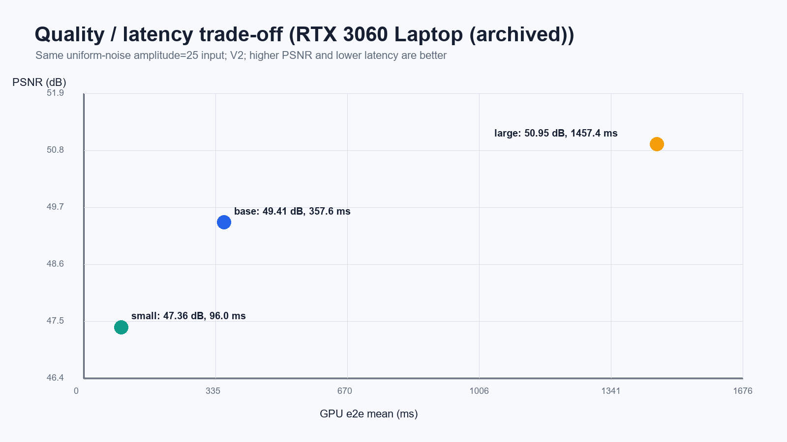

# CUDA 非局部均值降噪实验报告

2026 夏季训练营 · 选题 07 · blackbook537

本报告整理已有实验数据与实现，并按提交阅读顺序重写。跨平台性能来自重构前的存档，不代表本次结构调整后的全平台复测。每项数值均对应 assets/results/ 中的文件。

## 1. 实现与算法约定

程序读取灰度/RGB PNG 或 JPG，在 GPU 上完成 u8 interleaved 到 planar f32 的转换、NLM 加权计算和 u8 量化，再保存图像。输出格式由扩展名决定，使用时应与输入保持一致。主要计算由本项目 kernel 实现，stb 只承担图像编解码。

默认参数 pr=3、sr=10、h=10、sigma=25；支持 pr=1–8、sr=1–32。RGB 的三个通道共享由跨通道 patch 距离计算的权重；边界访问采用 clamp，等价于复制边界。

```text
N_patch = (2*pr+1)^2 * channels
dist = sum((P_p - P_q)^2)
w(p,q) = exp(-max(dist - 2*sigma^2*N_patch, 0) / h^2)
output(p) = sum(w(p,q)*input(q)) / sum(w(p,q))
```

题面示意公式的减项为 2*sigma²，而现有代码为 2*sigma²*N_patch。两种形式不能在固定 h 下直接视为等价。此次结构重构保留现有计算语义；需要按教师认可的 dist 定义进一步说明或修正。CPU/GPU 自洽验证只能证明双方采用相同计算，不能代替题意确认。

## 2. 优化实现

| 版本 | 实现 | 作用和限制 |
|---|---|---|
| V0 | 每线程处理一个像素 | 直接访问全局内存，作为基准 |
| V1 | shared memory + halo tile | 复用相邻 patch 数据；行 stride 加 padding |
| V2 | V1 + patch 模板展开 | pr≤3 使用展开；pr≥4 回退 V1 |

线程块协作加载复制边界的 halo，再在 tile 内计算距离。共享内存容量不足时回退 V0。V2 的速度收益与平台有关：历史 C500 数据中，base 参数 V2 比 V1 慢约 3.56 倍，因此 Make 在 MetaX 上默认选择 V1。

平台差异集中在 include/platform_api.h。src/kernels.cu 保存算法；MACA/MUSA 编译入口包含同一实现；Host 代码只保留一份。默认使用 expf，FAST_EXP=1 可选近似路径，新的近似误差结论需单独复测。

<!-- pagebreak -->

## 3. 正确性与图像质量

src/self_check.cpp 保留参数解析、指标函数、CPU 常量图不变性、确定性等 12 项自检。validate 对 V0/V1/V2 分别与 CPU 参考计算 MAE/PSNR，验证失败返回非零退出码。本季度 NLM 专项要求程序包含测试，因此迁移后保留这些入口。

历史 1080p RGB/base 验证记录中，三个 GPU 版本的 MAE=0、PSNR=inf。该结论仅限已测图像与配置；不能推广为任意输入或所有编译器均逐位一致。

合成图使用平滑渐变背景和确定性的 LCG 均匀噪声。生成器参数 sigma 为噪声幅度 a，未量化、未裁剪时标准差约为 a/sqrt(3)。因此以下结果不能表述为“高斯标准差 25 的自然图像降噪性能”。

| 图像/配置 | MAE 相对 clean | PSNR (dB) |
|---|---:|---:|
| 含噪，幅度 25 | 12.485684 | 24.947823 |
| small，pr2/sr7 | 0.803424 | 47.358490 |
| base，pr3/sr10 | 0.597227 | 49.414889 |
| large，pr4/sr14 | 0.463451 | 50.948416 |

来源：assets/results/rtx3060_laptop/quality_tradeoff.csv。三个滤波配置固定同一输入、h=10、sigma=25；只改变 patch 和搜索窗口。base 相对 noisy 提高约 24.47 dB。由于背景较平滑，不能据此证明复杂纹理和真实低照度场景下的细节保持能力。


<!-- pagebreak -->

## 4. 性能结果与统计口径

新 benchmark 每配置预热后重复采样，输出 kernel/e2e 的 mean、min、stddev。CPU 可对相同输入和参数单独重复。历史 NVIDIA legacy 文件只保存 kernel min 与 e2e mean，缺少原始样本，不能补算标准差。

e2e_ms 在 NlmDenoiseGpu 内计时：包含显存分配、H2D、转换、NLM、量化和 D2H；不包含文件读写，也不包含函数退出时的资源释放。H2D/D2H 使用 Host 计时，NLM kernel 使用设备 Event。Mpx/s 由像素数除以 kernel 时间计算。

| GPU / 配置 | 版本 | kernel (ms) | e2e (ms) | 统计口径 |
|---|---|---:|---:|---|
| 4090 D / 1080p RGB | V2 | 57.728 | 60.659 | min / mean |
| 4090 D / 4K RGB | V2 | 229.223 | 242.733 | min / mean |
| S4000 / 1080p RGB | V2 | 467.985 | 471.324 | mean，10 次 |
| S4000 / 4K RGB | V2 | 1842.982 | 1873.327 | mean，10 次 |
| C500 / 1080p RGB | V1 | 418.397 | 420.733 | mean，10 次 |
| C500 / 4K RGB | V1 | 1645.636 | 1655.068 | mean，10 次 |
| MR-V100 / 1080p RGB | V2 | 716.595 | 721.346 | mean，10 次 |
| MR-V100 / 4K RGB | V2 | 2869.991 | 2888.719 | mean，10 次 |

均为 base 参数；C500 为 25% sGPU 配额。表格用于展示本项目各环境的历史行为，设备配额、编译器和统计口径不同，不能用作跨 GPU 公平排名。原始文件、环境与 CPU 重复次数见 assets/results/README.md。


<!-- pagebreak -->

## 5. 质量与延迟权衡

下表来自 RTX 3060 Laptop 的配对质量与性能补充实验，V2、1080p RGB、同一幅度 25 输入、h=10、sigma=25。延迟为 5 次采样的均值与总体标准差。

| 配置 | PSNR (dB) | e2e mean ± stddev (ms) |
|---|---:|---:|
| small | 47.358 | 95.986 ± 0.976 |
| base | 49.415 | 357.573 ± 0.604 |
| large | 50.948 | 1457.434 ± 2.398 |

small 相对 base 约快 3.7 倍，PSNR 降低 2.06 dB；large 延迟约为 base 的 4.1 倍，PSNR 仅增加 1.53 dB。扩大窗口的质量收益在此合成场景中递减。来源：rtx3060_laptop/benchmark_quality.csv 和 quality_tradeoff.csv。



历史 4090 D 的 4K RGB/small kernel 最小耗时为 59.51 ms，而 base 为 229.22 ms。倒数帧率只描述 kernel 的理想处理能力，不能作为包含图像 I/O、资源释放和持续帧输入的完整应用帧率。small 还使用更小窗口，不能代替 base 条件的进阶目标。

<!-- pagebreak -->

## 6. 性能分析与证据边界

历史 RTX 4090 D nsys 摘要中，1080p RGB 的 V2 NLM kernel 为 61.036 ms，约占该设备区间的 99.9%。C500 的 mcTracer 1080p/V1 记录为 422.226 ms，约占求和设备事件时长的 99.617%。这些结果说明 NLM 主核占据主要设备时间。


时间占比本身不能区分算术吞吐、访存、指令调度或寄存器压力造成的瓶颈。现有材料缺少 ncu 硬件计数器；因此不再将“计算受限”“消除了 bank conflict”或“达到某占用率”写作已测结论。共享内存复用和模板展开的解释属于实现分析，需由计数器补充验证。

历史 NVIDIA 记录中 ncu 受硬件计数器访问限制；Moore/Iluvatar 环境未提供相应 profiler CLI。保留 nsys_profile.sh、ncu_profile.sh 和统一脚本中的 mcTracer 入口，工具缺失时明确记录跳过。

## 7. 后续工作

第一优先级是明确题面 dist 定义、sigma 标定及验收口径，并以独立样例验证；调整算法后须重采全部受影响结果。随后补充自然图像与受控噪声的来源和指标，再在正式提交 commit 上重跑 NVIDIA 1080p/4K 矩阵。

性能方向包括常驻缓冲池、减少重复 patch 距离计算、积分图或其他近似、寄存器复用。实际收益与精度代价需要实验评估，现有材料不足以预报具体加速倍数。

<!-- pagebreak -->

## 8. 复现与提交阅读指南

```bash
make build PLATFORM=nvidia ARCH=sm_89
make test PLATFORM=nvidia ARCH=sm_89
make run PLATFORM=nvidia ARCH=sm_89 \
  INPUT=test_images/noisy_1920x1080_3ch_sigma25.png
PLATFORM=nvidia ARCH=sm_89 bash scripts/reproduce.sh
```

其他设备分别设置 PLATFORM=iluvatar、metax、moore，SDK 路径通过 Make 变量或环境变量指定。脚本默认将新结果写入 output/results/<platform>/，不会自动覆盖历史证据。profiler 缺失时单独记录状态；小图 smoke run 不能作为性能验收。

| 材料 | 用途 |
|---|---|
| README.md | 构建、运行、版本、平台选择 |
| lab_report.md / lab_report.pdf | 实现、质量、性能与局限 |
| assets/results/README.md | 历史数据来源与重复次数 |
| assets/results/SHA256SUMS.txt | 整理后证据文件完整性 |
| test_images/README.md | 示例来源、配对关系、噪声定义 |
| SUBMISSION.md | 补充文件建议与本次结构验证记录 |

本次以参考作业的目录布局组织本项目，没有采用其双边滤波算法代码。多层 include、独立 tester/kernels 和重复实验文档已合并，原始冗余材料在本地仓库外备份。必要测试依据 NLM 专项的提交要求保留。

报告内容依据本地《2026夏季训练营 CUDA 方向项目》NLM 专项（第 13–15 页）、本项目源码和历史证据整理。没有收到具体 PR 评审意见，因此本报告不推断 PR 未通过的确定原因，也不声称目录调整即可保证通过。
